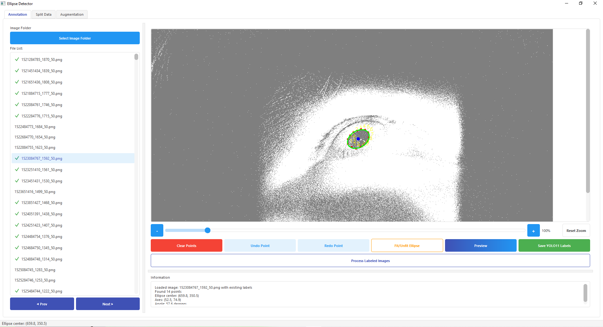
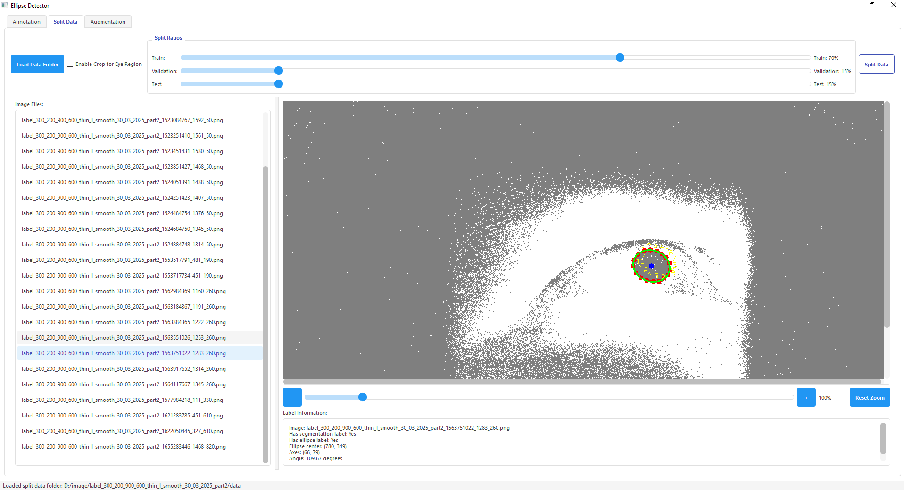
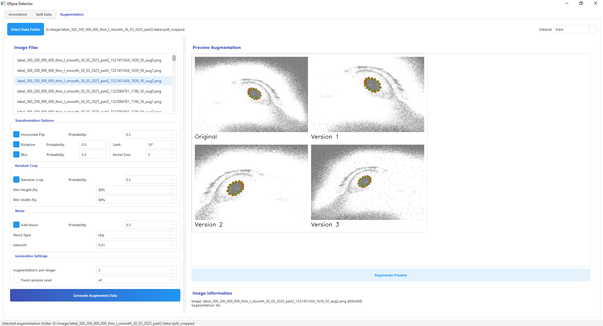
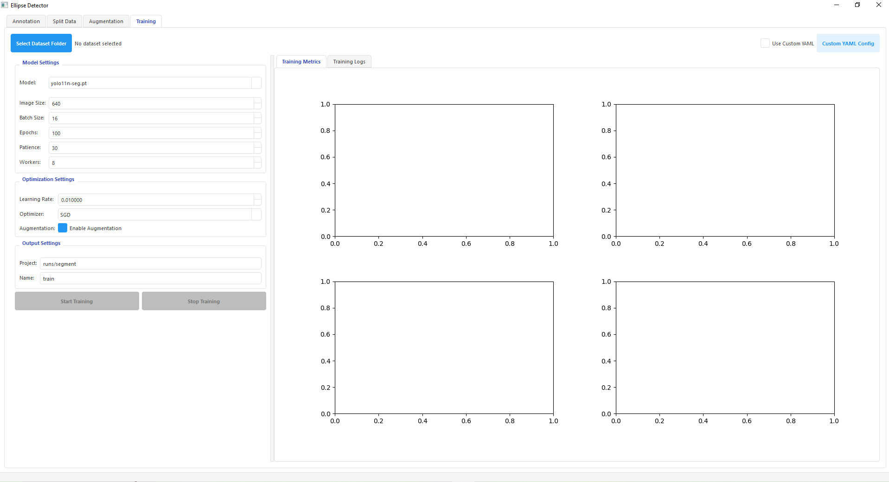

# Pupil Annotation Tool

A comprehensive tool for annotating, processing, augmenting, and training pupil detection models for computer vision applications.

## Features

- **Annotation**: Create precise pupil annotations with segmentation points and ellipse fitting
- **Data Splitting**: Split datasets into train/validation/test sets with customizable ratios
- **Eye Region Cropping**: Automatically crop images to the eye region
- **Data Augmentation**: Generate augmented datasets with various transformations
- **Model Training**: Train YOLO11 models directly within the application with real-time metrics

## Screenshots

### Annotation Screen


The annotation screen allows you to:
- Load image folders 
- Mark segmentation points around the pupil
- Automatically fit ellipse to points
- Save annotations in YOLO format
- Process labeled images to a standardized format

### Data Splitting Screen


The split screen provides functionality to:
- Load annotated datasets
- Set train/validation/test ratios
- Enable optional eye region cropping
- Preview annotations with visualization
- Process splits with consistent directory structure

### Augmentation Screen


The augmentation screen offers:
- Multiple transformation options (flips, rotation, blur, crop, noise)
- Preview of augmentation effects
- Batch processing of dataset images
- Preservation of annotation integrity during transformations

### Training Screen


The training screen enables you to:
- Select model size (nano, small, medium, large, xlarge)
- Configure training hyperparameters (batch size, image size, epochs)
- Optimize learning settings (learning rate, optimizer selection)
- Monitor training progress with real-time metrics
- View live training logs

## Directory Structure

The tool expects and generates the following directory structure:

```
dataset/
├── images/            # Original images
├── labels/            # Segmentation annotations (YOLO format)
├── labels_ellipse/    # Ellipse annotations (YOLO format)
├── data/              # Processed dataset with consistent naming
│   ├── images/  
│   ├── labels/
│   └── labels_ellipse/
└── split/             # Train/validation/test splits
    ├── train/
    │   ├── images/
    │   ├── labels/
    │   └── labels_ellipse/
    ├── valid/
    │   ├── images/
    │   ├── labels/
    │   └── labels_ellipse/
    └── test/
        ├── images/
        ├── labels/
        └── labels_ellipse/
```

After training, models and results are saved to:

```
runs/
└── segment/
    └── train/
        ├── weights/
        │   ├── best.pt        # Best model weights
        │   └── last.pt        # Last checkpoint weights
        ├── results.csv        # Training metrics
        ├── confusion_matrix.png
        └── ...                # Other training outputs
```

## Annotation Format

### Segmentation Format (YOLO)
```
class_id x1 y1 x2 y2 x3 y3 ...
```
Where:
- `class_id`: Integer class identifier (0 for pupil)
- `x1 y1 ... xn yn`: Normalized coordinates (0-1) of segmentation points

### Ellipse Format (YOLO)
```
class_id center_x center_y axes_x axes_y angle
```
Where:
- `class_id`: Integer class identifier (0 for pupil)
- `center_x center_y`: Normalized coordinates (0-1) of ellipse center
- `axes_x axes_y`: Normalized half-lengths of the ellipse axes
- `angle`: Rotation angle in degrees

## Requirements

- Python 3.8+
- PyQt5
- OpenCV-Python
- NumPy
- Albumentations (for augmentation)
- Ultralytics (for YOLOv8 training)
- Matplotlib (for training visualizations)

## Installation

1. Clone the repository:
```
git clone https://github.com/ngocthien2306/eye_ellipse_label_tool.git
cd eye_ellipse_label_tool
```

2. Install dependencies:
```
pip install -r requirements.txt
```

3. Run the application:
```
python main.py
```

## Usage Guide

### Annotation Workflow

1. Click "Select Image Folder" on the Annotation tab
2. Click on the pupil boundary to add segmentation points (minimum 5 points recommended)
3. Click "Fit/Unfit Ellipse" to automatically fit an ellipse to your points
4. Click "Save YOLO Labels" to save the annotations
5. Use "Process Labeled Images" to prepare the dataset for training

### Data Splitting Workflow

1. Click "Load Data Folder" on the Split tab
2. Adjust the split ratios as needed (default: 70% train, 15% validation, 15% test)
3. Optionally enable crop for eye region
4. Click "Split Data" to generate the train/validation/test sets

### Augmentation Workflow

1. Click "Select Data Folder" on the Augmentation tab
2. Choose which dataset to augment (train/validation/test)
3. Configure transformation options
4. Click "Generate Preview" to see example augmentations
5. Set "Augmentations per image" value
6. Click "Generate Augmented Data" to process the entire dataset

### Training Workflow

1. Click "Select Dataset Folder" on the Training tab
2. Choose model size and configure hyperparameters
3. Adjust optimization settings as needed
4. Click "Start Training" to begin the training process
5. Monitor real-time metrics and logs during training
6. Review results upon completion

## Contribution Guidelines

Contributions to improve the Pupil Annotation Tool are welcome. Please follow these steps to contribute:

1. Fork the repository
2. Create a feature branch (`git checkout -b feature/amazing-feature`)
3. Make your changes
4. Commit your changes (`git commit -m 'Add some amazing feature'`)
5. Push to the branch (`git push origin feature/amazing-feature`)
6. Open a Pull Request

### Coding Standards

- Follow PEP 8 guidelines for Python code
- Use descriptive variable and function names
- Add comments for complex logic
- Write unit tests for new features
- Update documentation as needed

## License

This project is licensed under the Apache License 2.0 - see the [LICENSE](LICENSE) file for details.

```
Copyright 2024 Pupil Annotation Tool Contributors

Licensed under the Apache License, Version 2.0 (the "License");
you may not use this file except in compliance with the License.
You may obtain a copy of the License at

    http://www.apache.org/licenses/LICENSE-2.0

Unless required by applicable law or agreed to in writing, software
distributed under the License is distributed on an "AS IS" BASIS,
WITHOUT WARRANTIES OR CONDITIONS OF ANY KIND, either express or implied.
See the License for the specific language governing permissions and
limitations under the License.
```

## Credits

Developed for pupil tracking and eye detection applications.